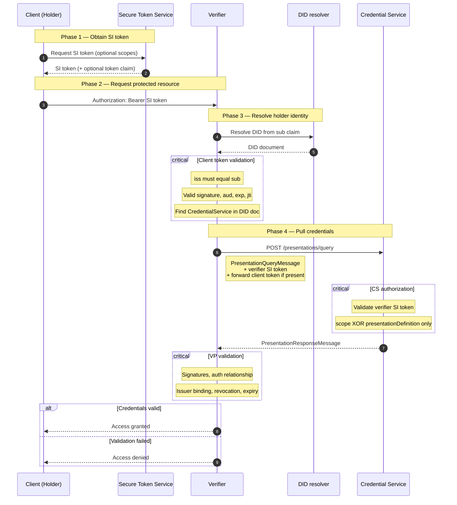
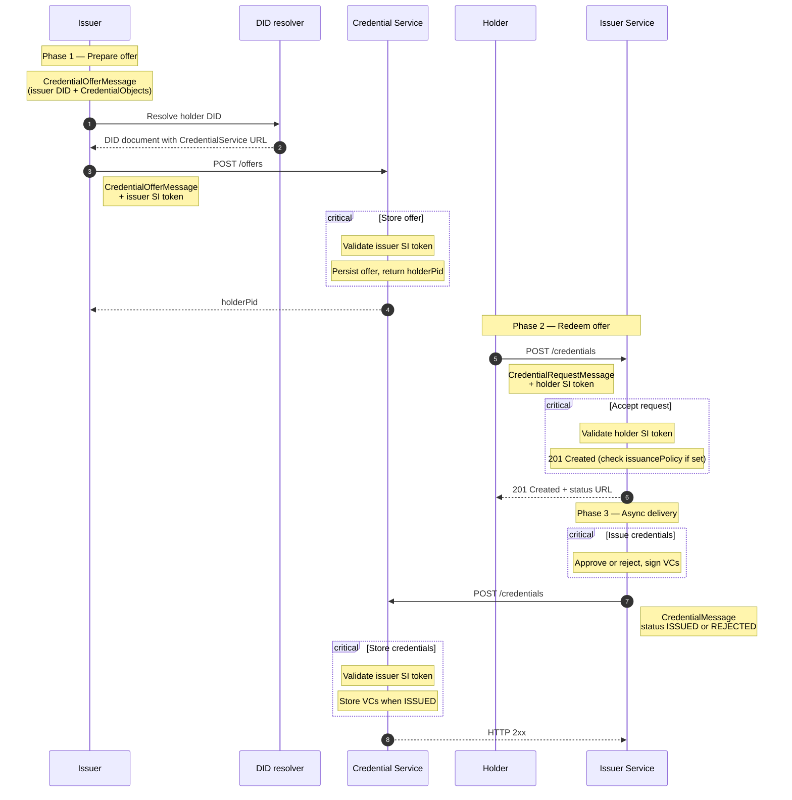

# DCP Java Library

Java library for the verifier-side and issuer-side of the [Eclipse Decentralized Claims Protocol (DCP) v1.0.1](https://eclipse-dataspace-dcp.github.io/decentralized-claims-protocol/v1.0.1/): the **Verifiable Presentation Protocol** and the **Credential Issuance Protocol** offer flow.

> **Status (0.1.x):** Wire DTOs, query/offer definitions, protocol validation helpers, configurable endpoint paths, and Spring Boot auto-configuration are available. HTTP clients, Self-Issued ID token validation, and cryptographic VP/VC verification are being added incrementally — see [implementation-plan.md](implementation-plan.md).

## Requirements

- Java 25 JDK
- Maven 3.9+

## Installation

Include the corresponding Maven dependency in your `pom.xml`:

```xml
<dependency>
  <groupId>de.eecc.dcp</groupId>
  <artifactId>dcp</artifactId>
  <version>0.1.0</version>
</dependency>
```

For Spring Boot applications, use the starter:

```xml
<dependency>
  <groupId>de.eecc.dcp</groupId>
  <artifactId>dcp-spring-boot-starter</artifactId>
  <version>0.1.0</version>
</dependency>
```

Check [Maven Central](https://central.sonatype.com/artifact/de.eecc.dcp/dcp/versions) for the latest package version.

## How the protocols work

DCP lets participants prove **who they are** and **what credentials they hold** without stuffing large credentials into every HTTP header. Everything is tied to a participant **DID** (decentralized identifier) and short-lived **Self-Issued ID Tokens** (SI tokens): JWTs the participant signs with their own key.

This library focuses on two flows from [DCP v1.0.1](https://eclipse-dataspace-dcp.github.io/decentralized-claims-protocol/v1.0.1/):

| Flow | Plain-language question | Who starts it |
|------|-------------------------|---------------|
| **Present** | “Show me credential X before I give you access.” | **Verifier** (after the client calls a protected API) |
| **Issue (offer)** | “I want to give you credential X — please claim it.” | **Issuer** (proactively offers credentials to the holder) |

Unlike OpenID for Verifiable Presentations (`openid4vp://` redirects), DCP uses a **pull model**: the verifier or issuer calls the holder’s **Credential Service** over HTTPS. There is no wallet deep link; correlation relies on SI token claims (`sub`, `aud`, `jti`) and an optional opaque `token` claim for Credential Service access control.

### Actors

| Actor | Role |
|-------|------|
| **Client / Holder** | The participant who owns credentials (company, person, connector). Identified by a DID in the `sub` claim of their SI token. |
| **Secure Token Service (STS)** | Issues SI tokens for the client. The request API is implementation-specific; DCP only defines the token format and how receivers validate it. |
| **Verifier** | Protects a resource (API, contract negotiation, …). Validates the client’s identity, then **pulls** matching Verifiable Presentations from the holder’s Credential Service. |
| **Issuer** | Signs and delivers Verifiable Credentials. In the offer flow, the issuer **pushes** an offer to the holder first; the holder redeems it later. |
| **Issuer Service** | The issuer’s HTTP API (`IssuerService` in the holder’s DID document for direct requests; offers reference the issuer DID). |
| **Credential Service** | The holder’s wallet / identity hub. Stores credentials, answers presentation queries, and accepts offers or deliveries. Advertised in the holder DID document with `type: CredentialService`. |
| **DID resolver** | Turns a DID into a DID document (keys, service endpoints). Any universal resolver or Identity Hub works. |

### Self-Issued ID Token checks (both flows)

Whenever a participant sends an SI token (`Authorization: Bearer …`), the receiver should validate it per the [spec](https://eclipse-dataspace-dcp.github.io/decentralized-claims-protocol/v1.0.1/#validating-self-issued-id-tokens):

- `iss` **must equal** `sub` (the participant’s own DID)
- Signature verifies against a `verificationMethod` with the **`capabilityInvocation`** relationship from the resolved DID document
- `aud` matches the receiver, `exp` / `nbf` are valid, and `jti` has not been seen before (replay protection)
- Optional **`token`** claim: opaque access token for the Credential Service; if the client sent one, the verifier or issuer **must forward** it in their own SI token when calling the Credential Service

### Present flow — prove credentials to a verifier

A client wants access to something the verifier protects. The verifier does not trust the client’s word alone; it fetches Verifiable Presentations from the holder’s Credential Service.



**Presentation query conditions** ([spec](https://eclipse-dataspace-dcp.github.io/decentralized-claims-protocol/v1.0.1/#presentation-query-message)):

- `PresentationQueryMessage` must contain **`scope`** or **`presentationDefinition`**, not both
- **`scope`**: normative aliases include `org.eclipse.dspace.dcp.vc.type:…` and `org.eclipse.dspace.dcp.vc.id:…`
- If the query used **`presentationDefinition`**, the response **must** include **`presentationSubmission`**
- Credential Service may return fewer presentations than requested if the holder is not entitled to some scopes (still HTTP 2xx)

### Issue flow — credential offer and redemption

An issuer proactively offers one or more credentials. The holder stores the offer, then sends a **credential request** to redeem it. Delivery is **asynchronous**: the issuer later POSTs the signed credential (or a rejection) back to the holder’s Credential Service.



**Offer and request conditions** ([Credential Issuance Protocol](https://eclipse-dataspace-dcp.github.io/decentralized-claims-protocol/v1.0.1/#credential-offer-flow)):

- **`CredentialOfferMessage`**: non-empty `credentials` array; each entry is a **`CredentialObject`** with at least `id` (sparse entries resolve against issuer `/metadata`)
- **`issuancePolicy`** on a `CredentialObject` (optional): Presentation Exchange definition of VPs the holder must prove before issuance
- **`CredentialRequestMessage`**: references `holderPid` and credential object `id` values from the offer; issuer responds **`201 Created`** on acceptance
- **`CredentialMessage`**: `status` is **`ISSUED`** or **`REJECTED`** for the whole request; signed VCs arrive in `credentials` when issued
- Holder DID document should advertise **`IssuerService`** when the holder may also initiate direct issuance requests (separate [issuance flow](https://eclipse-dataspace-dcp.github.io/decentralized-claims-protocol/v1.0.1/#issuance-flow) in the spec)

**Endpoint paths:** Defaults match DCP v1.0.1 (`/offers`, `/credentials` on Issuer Service, `/credentials` delivery, `/presentations/query`). Override per deployment via `DcpOptions.paths` or Spring `dcp.paths.*`. Use `DcpEndpointPaths.edcCompat()` for EDC-style routes (`/credentials` offers, `/issuance` requests).

### Library vs application responsibilities

Like [oid4vp](https://github.com/european-epc-competence-center/oid4vp), this library **does not ship REST controllers**. It owns DCP protocol mechanics; your application owns HTTP routes and transport:

| Layer | Library | Your application |
|-------|---------|------------------|
| **Definitions** | `PresentationQueryDefinition`, `CredentialOfferDefinition` — what to ask for / offer | Choose or implement templates (e.g. GS1) |
| **Wire messages** | `DcpPresentation.buildQueryMessage()`, `DcpIssuance.buildOfferMessage()`, … | Serialize JSON, set `Authorization: Bearer` SI token, POST to resolved URL |
| **URLs** | `presentationsQueryUrl()`, `offersUrl()`, `issuerRequestUrl()`, … | Discover Credential Service / Issuer Service base URLs from DID documents |
| **Verification** | `verifyQueryMessage()`, `verifyResponse()`, `verifyOffer()`, `verifyDelivery()`, … | Map `DcpException` to HTTP responses (`DcpExceptionHandler` in Spring) |
| **Business logic** | Optional callbacks (`OfferReceivedHandler`, …) | Grant access, persist contracts, trigger issuance workflows |

## Quick Start

A verifier validates a client **Self-Issued ID Token**, discovers the holder's **Credential Service** from their DID document, sends a **`PresentationQueryMessage`** to `POST /presentations/query`, and validates the returned **Verifiable Presentations**.

Create a library instance and define what credentials you need:

```java
import de.eecc.dcp.api.DcpOptions;
import de.eecc.dcp.api.DcpPresentation;
import de.eecc.dcp.message.PresentationQueryMessage;
import de.eecc.dcp.query.DcpScope;
import de.eecc.dcp.query.ScopeQueryDefinition;

import java.time.Duration;

DcpPresentation dcp = DcpPresentation.create(DcpOptions.builder()
        .sessionTtl(Duration.ofMinutes(5))
        .build());

ScopeQueryDefinition query = ScopeQueryDefinition.of(
        DcpScope.vcType("MembershipCredential"));

PresentationQueryMessage message = dcp.buildQueryMessage(query);
// POST JSON to dcp.presentationsQueryUrl(credentialServiceUrl) with Bearer SI token.
// On response: dcp.verifyAndExtractClaims(query, response);
```

`verifierDid` and DID resolution are configured when the identity layer is wired in; hosts typically provide a `DidDocumentResolver` pointing at a universal resolver or Identity Hub.

### Presentation Query Definitions

A presentation query definition describes **what** the verifier asks for. This is the DCP equivalent of oid4vp's DCQL-based `PresentationRequestDefinition`:

| oid4vp | DCP |
|--------|-----|
| `DcqlQuery` in the authorization request | `scope` array or `presentationDefinition` in `PresentationQueryMessage` |
| Wallet matches credential types + claim paths | Credential Service maps scopes to stored credentials (mapping is implementation-specific) |
| `PresentationRequestDefinition` | `PresentationQueryDefinition` |

DCP does **not** put claim paths on the wire. Normative scope aliases request credentials **by type** (`org.eclipse.dspace.dcp.vc.type:Member`) or **by id** (`org.eclipse.dspace.dcp.vc.id:…`). Alternatively, a full [Presentation Exchange](https://identity.foundation/presentation-exchange/) `presentationDefinition` can express richer constraints when the Credential Service supports it.

Implement `PresentationQueryDefinition` or use the built-in scope and PE implementations:

```java
import de.eecc.dcp.query.DcpScope;
import de.eecc.dcp.query.PresentationQueryDefinition;
import de.eecc.dcp.query.ScopeQueryDefinition;

// By VC type (normative alias org.eclipse.dspace.dcp.vc.type)
PresentationQueryDefinition byType = ScopeQueryDefinition.of(
        DcpScope.vcType("MembershipCredential"));

// By VC id (normative alias org.eclipse.dspace.dcp.vc.id)
PresentationQueryDefinition byId = ScopeQueryDefinition.of(
        DcpScope.vcId("8247b87d-8d72-47e1-8128-9ce47e3d829d"));

// Custom scope alias (implementation-specific mapping on the Credential Service)
PresentationQueryDefinition custom = ScopeQueryDefinition.of(
        DcpScope.parse("org.example.dcp.vc.type:MyCredential"));
```

After the Credential Service responds, validate the response shape and extract claims with the same definition:

```java
import de.eecc.dcp.claims.PresentationClaims;
import de.eecc.dcp.message.PresentationResponseMessage;

PresentationResponseMessage response = /* from CS */;

byType.assertResponseMatches(response);
PresentationClaims claims = byType.extractPresentationClaims(response);
Object issuer = claims.claimValues().get("presentation.0.verifiableCredential.issuer");
```

#### Scope format

DCP defines scopes as `[alias]:[discriminator]`, for example `org.eclipse.dspace.dcp.vc.type:Member`. Construct-X EDC often appends a non-normative operation suffix (`:read`, `:write`, `:*`); `DcpScope.parse()` accepts those strings and normalizes them to the spec format.

#### Presentation Exchange queries

For Presentation Exchange, wrap a `presentationDefinition` JSON object:

```java
import com.fasterxml.jackson.databind.ObjectMapper;
import de.eecc.dcp.query.PresentationExchangeQueryDefinition;

var mapper = new ObjectMapper();
var presentationDefinition = mapper.readTree("""
        {
          "id": "membership-pd",
          "input_descriptors": []
        }
        """);

PresentationQueryDefinition peQuery =
        new PresentationExchangeQueryDefinition(presentationDefinition);
```

When the query used `presentationDefinition`, the response **must** include `presentationSubmission` (validated by `assertResponseMatches`).

#### Built-in template: GS1 License Presentation

The library ships a ready-made definition for GS1 Company Prefix and Prefix License credentials (`Gs1LicenseQueryDefinition.INSTANCE`), mirroring oid4vp's `Gs1LicenseRequest`:

```java
import de.eecc.dcp.claims.PresentationClaims;
import de.eecc.dcp.message.PresentationQueryMessage;
import de.eecc.dcp.message.PresentationResponseMessage;
import de.eecc.dcp.query.template.gs1.Gs1LicenseQueryDefinition;

PresentationQueryMessage message = Gs1LicenseQueryDefinition.INSTANCE.toQueryMessage();
// POST message to Credential Service …

PresentationResponseMessage response = /* from CS */;
PresentationClaims claims = Gs1LicenseQueryDefinition.INSTANCE.extractPresentationClaims(response);
List<String> gcps = claims.values();
String partyGln = claims.identifier();
```

The query requests both `GS1CompanyPrefixLicenseCredential` and `GS1PrefixLicenseCredential` via DCP `vc.type` scopes. Your Credential Service must map those scope strings to the corresponding stored credentials.

### Credential offer flow

See [Issue flow](#issue-flow--credential-offer-and-redemption) above for the full sequence.

```java
import de.eecc.dcp.Constants;
import de.eecc.dcp.api.DcpEndpointPaths;
import de.eecc.dcp.api.DcpIssuance;
import de.eecc.dcp.api.DcpOptions;
import de.eecc.dcp.issuance.TypeCredentialOfferDefinition;
import de.eecc.dcp.message.CredentialOfferMessage;
import de.eecc.dcp.message.CredentialRequestMessage;

DcpIssuance issuance = DcpIssuance.create(DcpOptions.builder()
        // .paths(DcpEndpointPaths.edcCompat())  // optional EDC routes
        .build());

TypeCredentialOfferDefinition offer = TypeCredentialOfferDefinition.of(
        "did:web:issuer.example",
        TypeCredentialOfferDefinition.OfferedCredential.ofType(
                "urn:uuid:8247b87d-8d72-47e1-8128-9ce47e3d829d",
                "MembershipCredential",
                Constants.PROFILE_VC20_BSSL_JWT));

CredentialOfferMessage message = issuance.buildOfferMessage(offer);
// POST JSON to issuance.offersUrl(credentialServiceUrl) with issuer Bearer SI token.

// After the Credential Service returns holderPid:
CredentialRequestMessage request = issuance.buildRequestMessage(offer, "holder-pid-from-cs");
// POST JSON to issuance.issuerRequestUrl(issuerServiceUrl) with holder Bearer SI token.
```

On the holder Credential Service, validate inbound payloads with `issuance.verifyOffer(offer, message)` or `dcp.verifyQueryMessage(message)`. On delivery, use `issuance.verifyDelivery(credentialMessage)`.

### Verifier presentation flow

See [Present flow](#present-flow--prove-credentials-to-a-verifier) above for the full sequence.

**Application controller pattern** (you own the routes; the library builds and validates protocol objects):

```java
@RestController
@RequestMapping("/api/contracts")
class ContractController {

    private final DcpPresentation dcp;

    ContractController(DcpPresentation dcp) {
        this.dcp = dcp;
    }

    @PostMapping("/{id}/presentations/claims")
    PresentationClaims extractClaims(
            @PathVariable String id,
            @RequestBody PresentationResponseMessage response) {
        var query = ScopeQueryDefinition.of(DcpScope.vcType("MembershipCredential"));
        return dcp.verifyAndExtractClaims(query, response);
    }
}
```

For outbound queries, build the message with `dcp.buildQueryMessage(query)` and POST to `dcp.presentationsQueryUrl(credentialServiceUrl)` from your integration layer (HTTP client not included yet).

**Future facade API** (SI token validation and session wiring — adapt paths and token issuance to your application):

```java
import de.eecc.dcp.api.DcpPresentation;
import de.eecc.dcp.api.PresentationReceivedHandler;
import de.eecc.dcp.claims.PresentationClaims;
import de.eecc.dcp.query.ScopeQueryDefinition;
import de.eecc.dcp.query.DcpScope;
import de.eecc.dcp.session.PresentationSession;
import lombok.Getter;
import lombok.experimental.SuperBuilder;

ScopeQueryDefinition query = ScopeQueryDefinition.of(DcpScope.vcType("MembershipCredential"));

@Getter
@SuperBuilder
class ContractPresentationSession extends PresentationSession {
    // Application fields (never sent on the wire), e.g. contract offer id
    private String contractOfferId;
}

// Incoming request with client Bearer SI token
// dcp.handlePresentationRequest(clientBearerJwt, query, (session, response) -> {
//     PresentationClaims claims = query.extractPresentationClaims(response);
//     // issue DSP token, persist session, etc.
// });
```

Lower-level access: `query.toQueryMessage()` for the wire payload, `query.assertResponseMatches(response)` for structural checks, and `CredentialServiceClient` for HTTP calls once the client implementation is registered.

## Spring Boot

Add the starter dependency and configure session defaults in `application.yml`:

```yaml
dcp:
  session-ttl: 5m
  paths:
    offers: /offers
    credential-delivery: /credentials
    issuer-request: /credentials
    presentations-query: /presentations/query
    # EDC example:
    # offers: /credentials
    # issuer-request: /issuance
```

`DcpPresentation` and `DcpExceptionHandler` are auto-configured. Inject the facade where needed:

```java
import de.eecc.dcp.api.DcpPresentation;
import de.eecc.dcp.claims.PresentationClaims;
import de.eecc.dcp.message.PresentationQueryMessage;
import de.eecc.dcp.message.PresentationResponseMessage;
import de.eecc.dcp.query.template.gs1.Gs1LicenseQueryDefinition;
import org.springframework.web.bind.annotation.*;

@RestController
@RequestMapping("/api/dcp/presentations")
class PresentationController {

    private final DcpPresentation dcp;

    PresentationController(DcpPresentation dcp) {
        this.dcp = dcp;
    }

    @GetMapping("/query/gs1")
    PresentationQueryMessage gs1Query() {
        return Gs1LicenseQueryDefinition.INSTANCE.toQueryMessage();
    }

    @PostMapping("/claims/gs1")
    PresentationClaims extractGs1Claims(@RequestBody PresentationResponseMessage response) {
        var definition = Gs1LicenseQueryDefinition.INSTANCE;
        definition.assertResponseMatches(response);
        return definition.extractPresentationClaims(response);
    }
}
```

`DcpExceptionHandler` maps `DcpException` to HTTP responses using each `DcpError`'s `suggestedHttpStatus()`.

## Development

Clone the repository and run the build from the Maven parent:

```bash
git clone https://github.com/european-epc-competence-center/dcp.git
cd dcp/dcp-java
mvn test
mvn package
```

To install locally into your Maven repository:

```bash
mvn install
```

Then reference `0.1.0-SNAPSHOT` from a dependent project:

```xml
<dependency>
  <groupId>de.eecc.dcp</groupId>
  <artifactId>dcp</artifactId>
  <version>0.1.0-SNAPSHOT</version>
</dependency>
```

### Project Structure

```
dcp-java/
├── dcp-core/                       # artifact: dcp
│   └── src/main/java/de/eecc/dcp/
│       ├── api/                    # DcpPresentation facade, *Options, handlers
│       ├── identity/               # Self-Issued ID tokens, DID resolution
│       ├── message/                # PresentationQuery/ResponseMessage DTOs
│       ├── query/                  # PresentationQueryDefinition implementations
│       │   └── template/           # Built-in query templates (e.g. gs1)
│       ├── issuance/               # CredentialOfferDefinition implementations
│       ├── client/                 # CredentialServiceClient, CredentialStorageClient, IssuerServiceClient
│       ├── validation/             # PresentationValidator, DCP profiles
│       ├── session/                # PresentationSession, repository
│       ├── claims/                 # PresentationClaims extraction
│       ├── sts/                    # Optional Secure Token Service client
│       ├── exception/              # DcpError, DcpException
│       ├── vp/                     # VP/VC parsing helpers
│       └── service/                # Holder-side extension (phase 2+)
├── dcp-spring/                     # Spring Boot auto-configuration
└── dcp-spring-boot-starter/
```

See [implementation-plan.md](implementation-plan.md) for the full design and phased rollout.

## Repository Overview

```
/
├── dcp-java/             # Java library (Maven, Java 25)
├── scripts/              # Release tooling
├── implementation-plan.md
├── README.md
└── LICENSE
```

## License

Apache License 2.0 — see [LICENSE](LICENSE).
